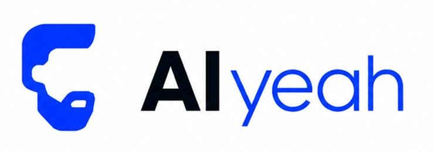
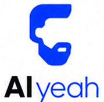

<p align="center">
  <a href="README.md">English</a> · <a href="README.id.md">Bahasa Indonesia</a>
</p>

<p align="center">
  
</p>

<p align="center">
  
</p>

<p align="center">
  <strong>"The AI that's always there."</strong>
</p>

<p align="center">
  A modular AI platform. An integration layer that picks the best tools per category<br/>
  and exposes them through a unified interface — for developers and non-technical users alike.
</p>

---

## Why AIyeah

Building AI-powered products today means integrating 10–20+ libraries manually — each with its own API contract, auth mechanism, and error model. Developers rebuild the same boilerplate every project. Non-technical users can't experiment without engineering support.

**AIyeah solves this** by providing a single, consistent interface to the AI ecosystem. Switch providers, add capabilities, and trace every call — without rewriting your integration layer.

---

## Architecture

```
┌─────────────────────────────────────────────────┐
│              Client Layer                         │
│   Next.js Web UI      REST API / SDK              │
└────────────────────┬────────────────────────────┘
                     │ HTTPS
┌────────────────────▼────────────────────────────┐
│            API Gateway (FastAPI)                  │
│   Auth · Rate Limiting · Request Routing         │
└────────────────────┬────────────────────────────┘
                     │
┌────────────────────▼────────────────────────────┐
│              Capability Layer                     │
│                                                   │
│  Model Gateway   RAG Engine    Agent Runner       │
│  Document AI     Memory        Search/Grounding   │
│  Text-to-SQL     Multimodal    Observability      │
│  Prompt Manager                                   │
└────────────────────┬────────────────────────────┘
                     │
┌────────────────────▼────────────────────────────┐
│            Integration Layer                      │
│  LiteLLM · LlamaIndex · LangGraph · Instructor   │
│  pgvector · LangFuse · Cohere · Jina             │
└────────────────────┬────────────────────────────┘
                     │
┌────────────────────▼────────────────────────────┐
│              Provider Layer                       │
│  OpenAI · Anthropic · Gemini · Ollama             │
└─────────────────────────────────────────────────┘
```

---

## Capability Modules

| Module | What it does | Built on |
|--------|-------------|----------|
| **Model Gateway** | Unified chat/completion/embedding across providers with fallback and cost tracking | LiteLLM |
| **RAG Engine** | End-to-end retrieval pipeline: ingest → embed → hybrid search → rerank → generate | LlamaIndex, pgvector, Cohere |
| **Agent Runner** | Multi-step reasoning agents with tool use and structured output | LangGraph, Instructor |
| **Document AI** | Parse PDF, DOCX, PPTX, HTML, images into structured, chunked text | Docling, Unstructured, Surya |
| **Memory System** | Persistent working, episodic, and semantic memory for agents and sessions | Mem0, pgvector |
| **Search & Grounding** | Web search for real-time agent grounding | Tavily, SearXNG |
| **Text-to-SQL** | Natural language to SQL with schema awareness and safe-mode execution | Vanna.ai, SQLCoder |
| **Multimodal** | Speech-to-text, text-to-speech, image understanding | Whisper, ElevenLabs, Moondream |
| **Observability** | Auto-trace every LLM call: tokens, cost, latency, retrieval scores | LangFuse, RAGAS, DeepEval |
| **Prompt Manager** | Version-controlled prompts with A/B testing and rollback | Custom + Agenta |

---

## Design Principles

- **Modular** — every capability works standalone. Compose what you need.
- **Provider-agnostic** — swap models without changing application logic.
- **Observable by default** — every LLM call is automatically traced.
- **Typed contracts** — all inputs and outputs use Pydantic schemas.
- **Fail explicitly** — clear errors, never silent failures.

---

## Tech Stack

| Layer | Technology |
|-------|-----------|
| API | FastAPI (Python) — async, type-safe, auto-generated OpenAPI |
| AI Orchestration | LangGraph, LlamaIndex, Instructor + Pydantic |
| Model Routing | LiteLLM — unified interface, automatic fallback |
| Database | PostgreSQL 16 + pgvector |
| Cache | Redis |
| Storage | MinIO (S3-compatible) |
| Observability | LangFuse, Prometheus + Grafana, Loki |
| Frontend | Next.js 15, Tailwind CSS, shadcn/ui |
| Infrastructure | Docker Compose (dev), Kubernetes (prod) |

---

## Roadmap

| Phase | Timeline | Focus |
|-------|----------|-------|
| **1. Foundation** | Weeks 1–3 | FastAPI project structure, LiteLLM multi-provider, auth, LangFuse traces, Docker Compose |
| **2. RAG Engine** | Weeks 4–5 | Document ingestion, chunking, hybrid search, reranking, RAGAS evaluation |
| **3. Agent Runner** | Weeks 6–8 | LangGraph agents, tool registry, structured output, memory, SSE streaming |
| **4. Polish** | Weeks 9–10 | Prompt manager, usage dashboard, API docs, security audit |

→ [Full PRD](docs/PRD.md) for detailed requirements and architecture decisions.

---

## Getting Started

> AIyeah is in Phase 1 (Foundation). Documentation and setup guide coming with the first release.

---

## Community

- [Contributing](CONTRIBUTING.md)
- [Code of Conduct](CODE_OF_CONDUCT.md)
- [Security Policy](SECURITY.md)
- [Support](SUPPORT.md)
- [Changelog](CHANGELOG.md)

---

## License

MIT © 2026 [Muhammad Faisal Affan](https://github.com/faisalaffan) — see [LICENSE](LICENSE).
