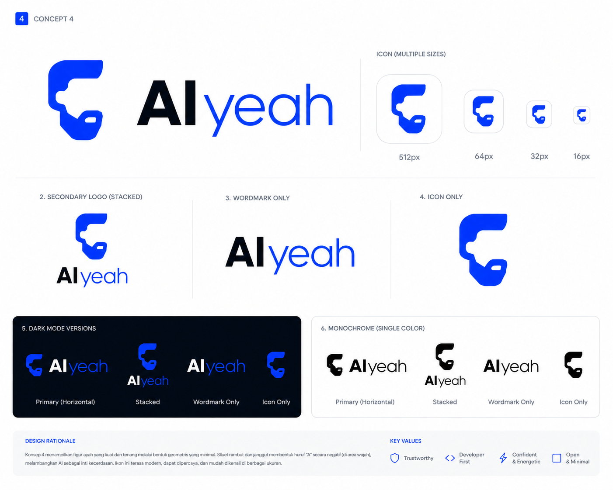

  <a href="README.md">English</a> · <a href="README.id.md">Bahasa Indonesia</a>

  

  
  &nbsp;&nbsp;
  

<h1 align="center">AIyeah</h1>

  <strong>"The AI that's always there."</strong>

  Open source AI library and platform for Southeast Asian developers — fast, practical, and built to be depended on.

---

## About

AIyeah was built on a simple idea: AI tools should feel like a trusted figure — present when you need them, honest when it matters, and strong enough to build on. The name carries three layers:

| Layer | Meaning |
|-------|---------|
| **AI** | The technology |
| **Ayah** | Indonesian for father — presence, guidance, reliability |
| **Yeah** | The confident energy of building something that works |

## Design Philosophy

- **Calm Authority** — Horizontal bars, not curves or sparks. Assess first, then respond.
- **Duality in Typography** — Bold precision (`AI`, weight 800) meets human voice (`yeah`, weight 400).
- **Two Colors Maximum** — Navy `#0A1628` + Cyan `#00D4FF`. Strong brands don't need more.
- **Scalability as Constraint** — If it doesn't work at 16px, it's not done.
- **Open Source Aesthetic** — No gradients, no shadows, no excess. Community-scalable design.

Read the full brand guidelines in [docs/BRAND.md](docs/BRAND.md).

## What We're Building

AIyeah is a **modular AI platform** — an integration layer that picks the best tools per category and exposes them through a unified interface. Two surfaces, one platform:

- **API / SDK** — compose AI capabilities programmatically
- **Web UI** — run AI workflows without writing code

Core modules: Model Gateway, RAG Engine, Agent Runner, Document AI, Memory System, Text-to-SQL, and Observability — all provider-agnostic and observable by default.

→ [Full PRD](docs/PRD.md)

## Getting Started

> Documentation and setup guide coming soon.

## License

MIT © 2026 Faisal Affan — see [LICENSE](LICENSE).
